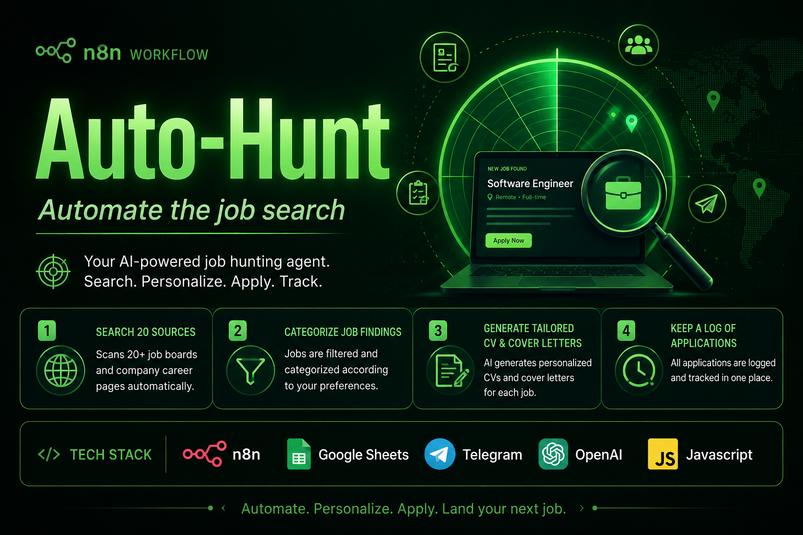
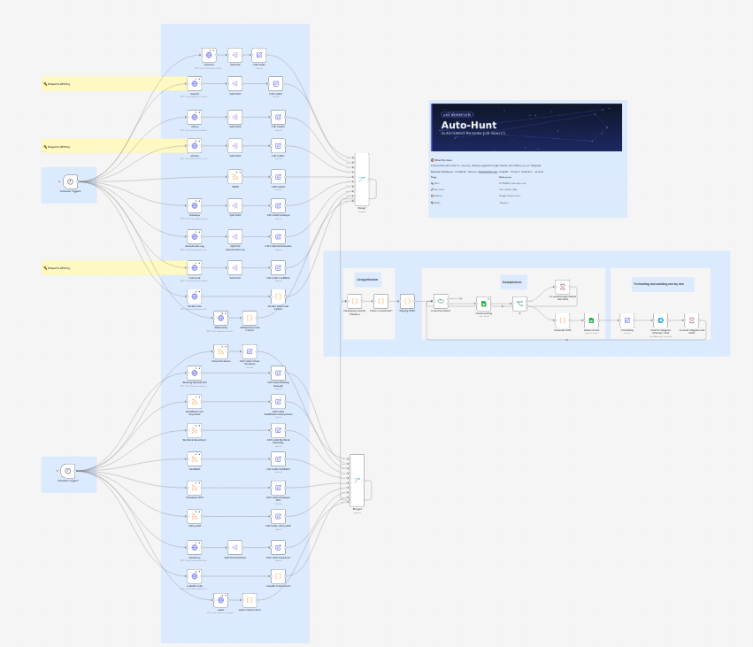
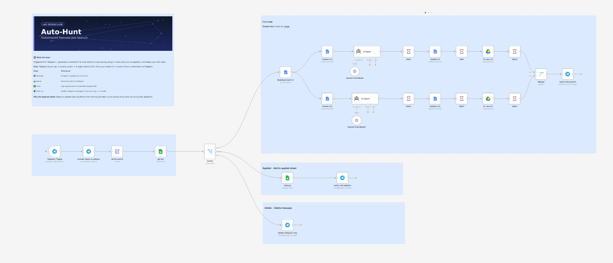

Auto-Hunt is a pair of n8n workflows that automatically search 20  remote-job sources, dedupe and classify the results, and notify you on Telegram — with a second workflow that generates a tailored CV and cover letter for each job using AI, on request.

## What it does

### 1. `Auto-Hunt.json` — Job Aggregator
On a schedule, this workflow:
- Pulls listings from ~20 sources in parallel: Himalayas, FindWork, Working Nomads, Arbeitnow, Rocket Jobs, JSRemotely, RemoteJobs.org, LinkedIn Jobs (guest API), Adzuna, Jobicy, JSearch (RapidAPI), Remotive, Virtual Vocations, Real Work From Anywhere, We Work Remotely, HireWeb3
- Normalizes each source's fields into a common schema
- Strips HTML from descriptions
- Classifies postings (e.g. remote-ness, category) via a Code node
- Deduplicates against previously seen jobs in a Google Sheet
- Logs new, unique jobs to Google Sheets
- Sends new matches to a Telegram channel/chat
- Includes rate-limit pacing (`Wait` nodes) for Google Sheets and Telegram

### 2. `Auto-Hunt_Feedback.json` — CV / Cover Letter Generator
Triggered from Telegram (e.g. tapping a button on a job notification), this workflow:
- Reads your master/"Grand" CV from Google Docs
- Uses an AI Agent (OpenAI) to tailor a CV and a cover letter to the specific job
- Creates and saves new Google Docs for the CV and CL
- Sends the generated documents back to you via Telegram
- Logs all the jobs you applied for in a in Google Sheet document for easy follow up.
- Delete Telegram messages with undesired job postings to reduce clutter.

## Architecture

```
[Schedule Trigger] → [Fetch from N sources] → [Normalize fields] → [Dedupe vs Sheet]
                                                                          ↓
                                                        [Log to Sheet] → [Notify on Telegram]

[Telegram Trigger] → [Switch on action] → [AI Agent: tailor CV/CL] → [Save to Drive/Docs] → [Send back via Telegram]
```

## Screenshots

| Job Aggregator workflow | Telegram notification / CV generation |
|---|---|
|  |  |

## Requirements

- A running [n8n](https://n8n.io) instance (cloud or self-hosted)
- Accounts / credentials for:
  - **Google Sheets** (OAuth2) — job log + dedup store
  - **Google Docs** (OAuth2) — CV/cover letter generation
  - **Google Drive** (OAuth2) — saving generated documents
  - **Telegram Bot** — notifications and the feedback trigger ([create one via @BotFather](https://core.telegram.org/bots#botfather))
  - **OpenAI API** — used by the AI Agent nodes to write tailored CVs/CLs
- API keys for the following job sources:
  - [FindWork.dev](https://findwork.dev/) — free API token
  - [Adzuna](https://developer.adzuna.com/) — `app_id` and `app_key`
  - [RapidAPI — JSearch](https://rapidapi.com/letscrape-6bRBa3QguO5/api/jsearch) — `x-rapidapi-key`
  - The remaining sources (Himalayas, Working Nomads, Arbeitnow, Jobicy, Remotive, RSS feeds, etc.) are free/public and need no key

## Setup

1. **Import both workflows** into n8n (`Import from File` for each JSON).
2. **Create credentials** in n8n for Google Sheets, Google Docs, Google Drive, Telegram, and OpenAI, then attach them to the corresponding nodes (they'll show as unset after import).
3. **Create a Google Sheet** to act as your job log/dedup store, and a Google Doc with your master CV. Update the placeholder IDs in the workflow:
   - `YOUR_GOOGLE_SHEET_ID` (Auto-Hunt.json)
   - `YOUR_GOOGLE_SHEET_ID_JOBS`, `YOUR_GOOGLE_SHEET_ID_FEEDBACK` (Auto-Hunt_Feedback.json)
4. **Add your API keys** to the relevant HTTP Request nodes (or better, move them into n8n credentials/environment variables):
   - `Find work` node → Authorization header → `YOUR_FINDWORK_API_TOKEN`
   - `adzuna` node → query params → `YOUR_ADZUNA_APP_ID`, `YOUR_ADZUNA_APP_KEY`
   - `Jsearch` node → header → `YOUR_RAPIDAPI_KEY`
5. **Set up your Telegram bot** and chat/channel ID in the Telegram nodes.
6. **Adjust the schedule triggers** to your preferred frequency.
7. Activate both workflows.

## Notes

- Credentials are referenced by name only in these exported JSON files — no secrets are embedded. You'll need to recreate/attach your own credentials in n8n after import.
- The job-search keywords (e.g. region, role type) are hardcoded in a few HTTP Request nodes (like JSearch's query) — edit these to match what you're looking for.
- This was built for personal use, so some node names are informal; feel free to tidy up as you adapt it.

## Acknowledgments

Built together with [Abdelrahman TC](https://github.com/Shots-Ammo) — thanks comrade.

## License

MIT — use, modify, and share freely.
